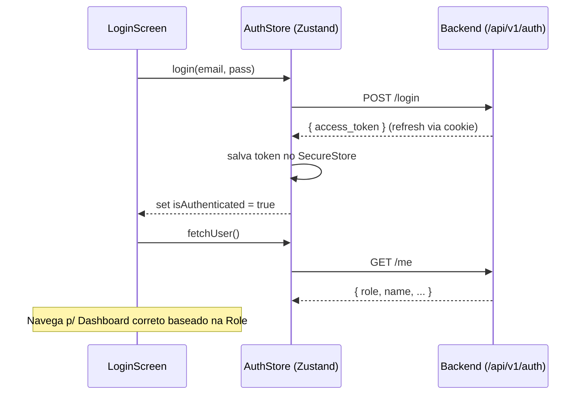

# Plano de ação — Integração Frontend (Fase 1: Autenticação)

> Base: [`SADE_implementation_plan.md`](./SADE_implementation_plan.md)  
> Objetivo: **Integrar as telas de Auth mockadas com a API Real do Backend**, dividindo o trabalho eficientemente entre 3 desenvolvedores frontend (React Native).

---

## Checklist de implementação

- [ ] [Dev 1] Configuração do cliente Axios (`api.ts`) e interceptors.
- [ ] [Dev 1] Configuração do `SecureStore` para tokens (Access e Refresh).
- [ ] [Dev 1] Integração da `LoginScreen` e fluxo de sessão (Login/Logout/Refresh).
- [ ] [Dev 2] Integração da `RegisterScreen` e formatação de payload (data de nasc., CPF).
- [ ] [Dev 2] Tratamento de erros HTTP 409 (Conflito) na UI de cadastro.
- [ ] [Dev 2] Integração do perfil de usuário (`GET /auth/me`) e roteamento por Role.
- [ ] [Dev 3] Integração do fluxo de Recuperação de Senha (Esqueci, Redefinir, Alterar).
- [ ] [Dev 3] Criação de painel provisório "Admin" para exibir Audit Logs e Dados de Teste.

---

## Contexto atual no código

| Ponto | Situação hoje |
|-------|----------------|
| Fluxo de Login | `store/authStore.ts` — Mock estático chamando `login('PATIENT', ...)` |
| UI do Cadastro | `RegisterScreen.tsx` — Existe e captura dados, mas não envia requisição |
| Refresh Token | Inexistente no App. O backend gerencia via Cookie (requer atenção no app) |
| Permissões de Rota | A navegação não bloqueia telas por *Role* real (apenas hardcoded do mock) |
| Recuperação de Senha | Modal existe em `LoginScreen`, mas botão "Enviar link" não aciona a API |

**Gap principal:** As telas estão criadas com ótima qualidade visual, mas o estado global e as ações dos botões não disparam as requisições HTTP para a API `/api/v1/auth`, inviabilizando o uso real do aplicativo.

---

## Decisão de produto (aprovar antes de codar)

### Proposta recomendada: Divisão de Tarefas por Fluxo (3 Devs)

Para não gerar gargalos ou conflitos (*merge conflicts*) nos arquivos de navegação ou estado, a divisão paralela será:

| Dev / Foco | Entregáveis |
|-------------------|--------|
| **Dev 1 (Base & Sessão)** | Base Axios, Interceptors, SecureStore, Zustand, Tela de Login e Logout. |
| **Dev 2 (Cadastro & Perfil)** | Tela de Cadastro (validação e payloads), GET `/me`, redirecionamento dinâmico por Role. |
| **Dev 3 (Secundários & Admin)** | Recuperação de Senha, Alteração de Senha, Tela Admin (Audit Logs + Dados de Teste). |

---

## Arquitetura técnica (Frontend)

### Cliente HTTP (Axios)

- Arquivo: `src/services/api.ts` (a ser criado)
- Base URL: Variável de ambiente `EXPO_PUBLIC_API_URL`
- Comportamento Global: Um interceptor que escuta requisições `401 Unauthorized` e tenta bater em `/api/v1/auth/refresh`. Importante: o *withCredentials* deve ser habilitado se o backend enviar o refresh token como cookie.

### Fluxo interno de Sessão



---

## Matriz de decisão por resposta HTTP

| Status Code | Action (Backend) | Comportamento UI | Observação |
|------------|-----------|-------------------|------------|
| `200/201` | Sucesso | Sucesso visual + Redirecionamento | Salvar tokens/dados |
| `401` | Unauthorized | Fazer chamada `/refresh` silenciosa. Se falhar, ir p/ tela de Login | Apagar tokens inválidos do celular |
| `409` | Conflict (Duplicado) | Mostrar erro de "CPF/E-mail já existente" no formulário | Tratar na Tela de Cadastro |
| `422` | Unprocessable Entity | Destacar campos inválidos (ex: bordas vermelhas) | Erro de validação de campo |
| `500` | Server Error | Mostrar Toast/Alerta de Erro Genérico | "Tente novamente mais tarde" |

---

## Ajustes no fluxo de Navegação

### 1. Root Navigator
- Se o estado global possuir um `token` válido e buscar o `/me` com sucesso → Navegar para o **AppStack** (rotas logadas).
- Se `token` inválido/vazio → Navegar para o **AuthStack** (login/cadastro).

### 2. AppStack Dinâmico
O roteamento interno do AppStack dependerá da `role` (perfil):
- Se `role === 'PATIENT'` → Renderiza `PatientDashboard`.
- Se `role === 'GESTOR'` → Libera visualização do menu provisório para a **Tela de Auditoria e Teste** (construída pelo Dev 3).

---

## Configuração e operação

### Variáveis `.env` (Frontend)

Criar o arquivo `.env` na raiz do projeto `frontend-sade`:

```env
EXPO_PUBLIC_API_URL=http://localhost:8000/api/v1
```
*(Nota importante: se testando via celular físico ou emulador Android, o "localhost" deve ser substituído pelo IP da máquina de desenvolvimento, ex: 192.168.0.x).*

---

## Testes

### Manuais (Integração)

| # | Cenário | Resultado esperado |
|---|---------|-------------------|
| 1 | Cadastro com dados existentes | Erro retornado (409), aplicativo exibe toast ou erro inline. |
| 2 | Login com sucesso | Token guardado via SecureStore, request p/ `/me` feito, navegação pra Home. |
| 3 | Fechar o App e Abrir | Token resgatado do SecureStore, sessão restaurada (não pede login). |
| 4 | Token expirado | App chama rotina silenciosa de Refresh Token, e caso de erro, desloga e envia pro login. |
| 5 | Acesso Tela de Admin (Dev 3) | Apenas usuário validado pela API como `GESTOR` consegue abrir a tela de Logs/Dados. |

---

## Ordem de implementação

1. **Dev 1:** Criar e comitar configuração do cliente HTTP e Zustand global. *(Desbloqueia os outros 2 devs)*.
2. **Dev 1:** Realiza fluxo base de `LoginScreen`.
3. **Dev 2 e Dev 3:** Puxam a branch do Dev 1 e iniciam suas chamadas usando a infraestrutura base.
4. **Dev 2:** Adapta formulários nativos do `RegisterScreen` e formata pro JSON esperado na rota.
5. **Dev 3:** Ajusta o fluxo de "Esqueci minha senha" e a tela de listagem `/audit-logs`.

---

## Riscos

| Risco | Mitigação |
|-------|-----------|
| **Refresh Token em Cookie no React Native** | O backend foi programado para mandar o Refresh via HTTP-Only Cookie. Em React Native, gerenciar cookies pode ser instável dependendo da versão do OS. **Mitigação:** Dev 1 deve garantir que o Axios esteja com `withCredentials: true` para salvar/enviar os cookies nativamente ou pedir apoio ao backend se precisar trocar para body/header. |
| **Merge Conflicts em Store/Routes** | Muitos devs mexendo no Zustand e React Navigation. **Mitigação:** Dividir a store em "slices" independentes ou o Dev 1 ser o revisor de tudo relacionado à navegação global. |

---

## Implementação Visual (Gluestack-UI v2)

Para garantir a fidelidade aos protótipos de alta definição (pasta `prints`), a base visual do projeto foi atualizada utilizando a biblioteca **Gluestack-UI** e **NativeWind**.

### Telas Implementadas:
1. **LoginScreen (`src/screens/Auth/LoginScreen.tsx`)**
   - **Visual Refinado:** Banner verde arredondado, Inputs customizados com ícones da biblioteca `lucide-react-native` (Email, Cadeado e Olho), e botão sólido verde escuro `#2A5D44`.
   - **Integração:** Conectada perfeitamente à base do `authStore.ts` e do Axios.

2. **PatientDashboard (`src/screens/Dashboard/PatientDashboard.tsx`)**
   - **Visual Refinado:** Card de ação principal "Iniciar Novo Exame", rolagem horizontal nativa (ScrollView) para dependentes, listagem de últimos exames formatados com cores de status dinâmicas (Negativo/Atenção).

3. **AddDependentScreen (`src/screens/Dependents/AddDependentScreen.tsx`)**
   - **Visual Refinado:** Cabeçalho simples de voltar, botões seletores visuais de "Sexo" onde o selecionado ganha destaque verde e ícone de "check".

### Estrutura de Pastas Gerada:
```
src/
  ├── components/
  ├── navigation/
  ├── screens/
  │   ├── Auth/
  │   ├── Dashboard/
  │   └── Dependents/
  ├── services/
  │   └── api.ts
  ├── store/
  │   └── authStore.ts
  └── theme/
```
